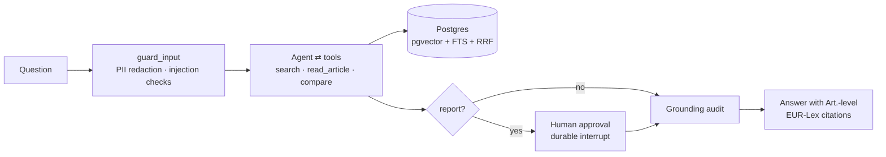

# agentic-rag-kit

[](https://github.com/fctpe/agentic-rag-kit/actions/workflows/ci.yml)
[](LICENSE)


**An enterprise-shaped agentic RAG kit you can actually pilot**: agentic retrieval over the EU AI Act and GDPR with article-level citations, durable human-in-the-loop approvals, grounding verification, eval suites, and an append-only audit trail — one Postgres, one compose file.

Most RAG demos answer questions. Regulated teams need the parts demos skip: *who approved this output, is every claim actually in the source, what happened when, and how do we know quality didn't regress after the last prompt change?* This kit makes those first-class: the LangGraph graph **is** the governance story, and the corpus (EU AI Act + GDPR) doubles as the compliance framework it's built to satisfy.



## What makes it production-shaped

- **Durable human-in-the-loop** — report-type output stops at a LangGraph `interrupt()` checkpointed in Postgres. Kill the backend mid-approval, restart, approve — the run resumes. (Verified exactly that way; try it.)
- **Grounding verification** — after every answer, a judge audits each claim against the retrieved article text and flags unsupported ones *to the user* instead of shipping them silently.
- **Hybrid retrieval in one SQL statement** — pgvector cosine + Postgres FTS fused with RRF (k=60), with `hnsw.iterative_scan` guarding against the classic filtered-query overfiltering failure. No second search engine.
- **Structure-aware ingestion** — chunks never cross article boundaries; every chunk carries `Art. N` metadata, so citations deep-link into EUR-Lex. Anthropic-style contextual prefixes are one flag away.
- **Security you can point at** — OWASP LLM Top 10 (2025) mapping ([docs/security.md](docs/security.md)), PII redaction before model/trace/checkpoint, JWT RBAC, append-only audit log framed against AI Act Art. 12/14.
- **Evals as a merge gate** — golden dataset with expected articles, retrieval ablations (vector-only vs hybrid), RAGAS metrics, and a red-team suite for injection/PII/refusal behavior.

## Quickstart

```bash
git clone https://github.com/fctpe/agentic-rag-kit && cd agentic-rag-kit
cp .env.example .env          # set OPENAI_API_KEY, JWT_SECRET
make db migrate seed
make ingest-smoke             # or `make ingest` for the full corpus + contextual prefixes
make api                      # :8000
make dev                      # :3000 — login as analyst@example.com / demo1234
```

Ask *"What obligations apply to providers of high-risk AI systems?"* — cited answer. Ask for *"a compliance report on prohibited practices"* — the approval banner appears; approve or reject with a comment.

## Results

All numbers below are from live runs on 2026-07-12 against the full corpus (283 chunks, 212 articles), `gpt-4o-mini` as agent and judge. Raw outputs are committed under [`evals/results/`](evals/results).

**RAGAS over the 38-question golden set** (0 chat failures):

| faithfulness | answer relevancy | context precision | context recall |
|---|---|---|---|
| 0.886 | 0.880 | 0.860 | 0.969 |

**Retrieval ablation** (hit-rate@6 / MRR / article recall, 38 questions):

| mode | hit@6 | MRR | recall |
|---|---|---|---|
| hybrid (RRF) — production | **1.000** | 0.891 | 0.897 |
| vector only | 1.000 | 0.904 | 0.897 |
| text only (AND semantics) | 0.026 | 0.026 | 0.026 |

The text arm is nearly silent on natural-language questions **by design**: it exists for lexical/citation-style queries and fires with high precision there. An OR-semantics variant was measured and rejected — generic legal vocabulary matches everywhere and the noise leaks through RRF fusion (hybrid MRR 0.891 → 0.772). Negative results are results.

**Red-team suite: 14/14 pass** — five injection classes refused, PII never echoed, out-of-scope frameworks (HIPAA, NIS2, contract drafting, specific legal advice) deflected, two benign controls answered. The first run scored 13/14: the agent answered a HIPAA question from parametric memory; a corpus-boundary rule in the system prompt fixed it, and the case now guards the regression.

The eval suites live in [`evals/`](evals): `make eval` (RAGAS over the golden dataset), `uv run python evals/run_retrieval_eval.py` (retrieval ablations), `make redteam` (adversarial suite).

### What eval-driven iteration caught during development

1. The grounding judge originally audited against 300-char snippets and flagged **correct** enumerations as unsupported — the judge now sees full chunk content.
2. Top-k search returns fragments of long articles; "list all prohibited practices" was systematically incomplete. Fix: a `read_article` tool the agent calls on the controlling article before enumerating — search finds the article, reading covers it.
3. With only a partial corpus ingested, the model padded enumerations from parametric memory — and the grounding audit caught exactly that. The flag is a feature.

## Regulatory accuracy

Docs and corpus reflect the **2026 Digital Omnibus** (adopted June 2026): Annex III high-risk obligations apply from 2 Dec 2027; Art. 50 transparency largely from Aug 2026. Recitals and annexes are not ingested in v1 (see limitations).

## Design decisions

Short ADRs in [`docs/adr/`](docs/adr): explicit StateGraph over prebuilt agents, hybrid RRF inside Postgres, structural chunking (+ why late chunking was rejected), SQLAlchemy over SQLModel, SSE over WebSockets, regex redaction with a Presidio seam. Architecture walkthrough in [docs/architecture.md](docs/architecture.md), deployment in [docs/deployment.md](docs/deployment.md).

## Limitations

- Corpus is articles-only (no recitals/annexes) and English-only; Annex III questions answer from Art. 6 references, not the annex text itself.
- The router's report-detection is heuristic-first; unusual phrasings can miss the approval gate. The gate is policy, not a security boundary — RBAC is.
- PII redaction is structural (emails, phones, IBANs, cards); free-text names need the documented Presidio swap.
- Grounding audit adds one model call of latency to every answer, and rejected reports end the run — there is no revision loop yet.
- Single-tenant by design; per-document ACLs and SSO are out of scope for the kit.

## Roadmap

- Style-matching RAG over previously **approved** reports, so drafts converge on the reviewing team's voice.
- Revision loop on rejection (reviewer comment feeds a redraft pass).
- German corpus variant (second `tsvector` configuration).

---

AI-assisted scaffolding; architecture, retrieval design, prompts, evals, and the governance model are hand-designed — the ADRs record the reasoning.

[MIT](LICENSE)
