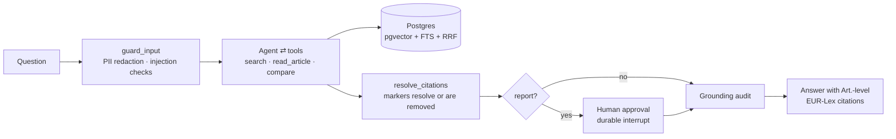

# agentic-rag-kit

[](https://github.com/fctpe/agentic-rag-kit/actions/workflows/ci.yml)
[](LICENSE)


**An enterprise-shaped agentic RAG kit you can actually pilot**: agentic retrieval over the EU AI Act and GDPR with article-level citations, durable human-in-the-loop approvals, grounding verification, eval suites, and an append-only audit trail — one Postgres, one compose file.

Most RAG demos answer questions. Regulated teams need the parts demos skip: *who approved this output, is every claim actually in the source, what happened when, and how do we know quality didn't regress after the last prompt change?* This kit makes those first-class: the LangGraph graph **is** the governance story, and the corpus (EU AI Act + GDPR) doubles as the compliance framework it's built to satisfy.

|  |  |
|---|---|
|  |  |
| Every answer is grounded in article-level sources, shown in a live citation panel with EUR-Lex links. | Report-type output stops at a durable approval gate — approve or reject with a comment for the audit trail. |



## What makes it production-shaped

- **Durable human-in-the-loop** — report-type output stops at a LangGraph `interrupt()` checkpointed in Postgres. Kill the backend mid-approval, restart, approve — the run resumes. (Verified exactly that way; try it.) A report is never streamed: the draft reaches the user in the approval payload or not at all, and an admin can decide another user's approval, so reviewer and author need not be the same person ([ADR 0001 addendum](docs/adr/0001-langgraph-explicit-stategraph.md)).
- **Grounding verification** — after every answer, a judge checks each claim against the retrieved article text and reports the ones **no** source supports *to the user* instead of shipping them silently. It verifies support, not attribution: a claim that cites the wrong article passes as long as some retrieved source backs the claim itself. That is deliberate — checking the numbers made it flag correct enumerations — and [docs/security.md](docs/security.md) states the boundary. A qa answer streams before the verdict exists, and the UI shows that window as unverified rather than rendering an unchecked answer identically to a checked one.
- **A linkable citation marker is a property of the system, not a request to the model** — the UI links exactly one shape, `[n]`, and the model reliably writes something else: it welds the reference into the bracket (`[4, Art. 4(5)]`, 126 such brackets across the committed eval runs, none of them a link). Asking for the shape in the system prompt was tried, measured, and made it *worse* — so a deterministic node rewrites the merged shapes, **removes** any index that was never retrieved, and refuses to link a bracket whose spelled-out reference contradicts the source it numbers, reporting each refusal instead of guessing. No model call. Replaying every answer in the committed eval artifacts against its real source list is offline and free — `cd backend && uv run --group dev --group evals pytest tests/test_citation_markers.py -s -k merged` prints the census (120 of 126 became links; the 6 refusals are all article-vs-source disagreements) ([ADR 0007](docs/adr/0007-citation-markers-resolved-in-code.md)).
- **Hybrid retrieval in one SQL statement** — pgvector cosine + Postgres FTS fused with RRF (k=60), with `hnsw.iterative_scan` guarding against the classic filtered-query overfiltering failure. No second search engine.
- **Structure-aware ingestion** — chunks never cross the boundary of the unit they came from, and every chunk carries that unit's ref (`Art. 6`, `Annex III`), so citations deep-link into the right place in EUR-Lex (`#art_6`, `#anx_III`). Annexes are ingested and chunked as units in their own right, not folded into the last article: the AI Act's high-risk list is Annex III, and Art. 6(2) only points at it. Anthropic-style contextual prefixes are one flag away.
- **Security you can point at** — OWASP LLM Top 10 (2025) mapping ([docs/security.md](docs/security.md)), PII redaction at the API boundary — before the model, a trace, *and* the checkpointer, which is the one that took a test against real checkpoint contents to get right ([ADR 0004](docs/adr/0004-sqlalchemy-sse-redaction-choices.md)) — JWT RBAC, and a hash-chained audit log framed against AI Act Art. 12/14: `GET /audit/verify` walks the chain and names the first entry an edit — or a deletion between two others — broke. It is tamper-*evidence*, not tamper-proofing; [docs/security.md](docs/security.md#audit-trail-eu-ai-act-art-12-framing) states exactly what it does not catch.
- **Telemetry that survives the request** — OpenTelemetry spans on the GenAI semantic conventions around every graph node, tool call, retrieval and the grounding verifier, with token and cost accounting from `usage_metadata`, plus JSON logs correlated by request and trace id. Exports OTLP to any collector — Langfuse included, which is why it stays. Unset endpoint means no exporter at all ([ADR 0006](docs/adr/0006-otel-genai-spans-and-structured-logs.md)).
- **Evals built to gate merges** — golden dataset with expected articles, retrieval ablations (vector-only vs hybrid), RAGAS metrics, and a red-team suite for injection/PII/refusal behavior. CI validates the dataset and compiles the suites on every push; wiring the scored runs in as a blocking gate needs a provider key and is a one-line CI change (documented in [docs/deployment.md](docs/deployment.md)).

## Quickstart

```bash
git clone https://github.com/fctpe/agentic-rag-kit && cd agentic-rag-kit
cp .env.example .env          # set OPENAI_API_KEY, JWT_SECRET
make db migrate seed
make ingest-smoke             # 10 units per regulation, straight from the committed corpus
make api                      # :8000
make dev                      # :3000 — login as analyst@example.com / demo1234
```

The corpus is committed under [`data/fixtures/`](data/fixtures) — the EU AI Act and GDPR as this repo's parser produced them — so a clean clone ingests without depending on EUR-Lex being in a good mood. It holds **212 articles and 13 annexes → 284 chunks** (AI Act 167, GDPR 117): articles (`Art. 6`) and annexes (`Annex III`) are separate citable units, because Art. 6(2) makes an AI system high-risk by pointing at the list in Annex III and the list exists nowhere else. `make ingest-fixture` loads all of it; `make ingest` re-fetches the same units from live EUR-Lex. The two fixture targets need **no provider key at all** — see the two paragraphs below; `make ingest` does, because it generates prefixes and embeddings as it goes.

**The contextual prefixes are committed too**, in [`data/fixtures/context_prefixes.json`](data/fixtures) — one LLM-written sentence per chunk, each keyed by a hash of the chunk it describes. They used to be written at ingest time, and `temperature=0` is not determinism: there is no seed and no provider guarantees one, so two ingests of the *same* committed fixture produced different prefixes, and therefore different embeddings and different retrieval numbers. That broke the promise the committed corpus exists for: a reviewer could not reproduce a committed number, because they could not reproduce the corpus — and `evals/thresholds.yaml` sets its retrieval floors just under baseline on the premise that retrieval is deterministic. `make ingest-fixture` now *reads* those sentences and **fails closed** if the cache does not cover the corpus, naming the missing chunks and the command to fix it — it does not call the model on a miss (that is the non-determinism being removed) and does not degrade to the deterministic prefix (that is an unlabelled third corpus). `make ingest` still generates them, because a fresh EUR-Lex parse has no cache by definition and is not what a committed number describes. Regenerating is one model call per chunk, so it is its own target — `make prefix-cache` — and deliberately not part of the free `make refresh-fixtures`; `backend/tests/test_prefix_cache.py` fails offline when the two drift apart.

**And the embedding vectors are committed too**, in [`data/fixtures/chunk_embeddings.json`](data/fixtures) — because committing the prefixes did not actually make the corpus reproduce, and the claim that it did was checked against the wrong column. A SHA-256 over `chunks.context_prefix` was identical across ingests, so the text was pinned; `chunks.embedding` — the column the vector arm ranks on — still differed on every pair of ingests, because the embedding endpoint does not return bit-identical vectors for identical input. The deltas are small and that is not the point: a corpus whose ranking column changes between ingests is not a corpus a committed number describes. ([ADR 0003](docs/adr/0003-structural-chunking-contextual-prefixes.md) records what was measured on the way to this decision; the property that reproduces today is the digest check below.) The vectors are now generated once, keyed by a hash over the **embedding model, the dimension count and the exact embedded string** (so a model change invalidates the cache rather than pairing this text with vectors from another embedding space), stored as base64 float32 — the width pgvector keeps — at 2.2 MiB, and read at fixture-ingest time with the same fail-closed rule as the prefixes. `make embedding-cache` regenerates them, and like `make prefix-cache` it costs money and is nobody's accident.

Two consequences worth stating, and the first is the one that changes what this README is worth. A fixture ingest now calls **no provider at all**, so a reviewer with no API key can re-derive the corpus these numbers were measured on rather than take it on trust:

```bash
make db migrate ingest-fixture     # no OPENAI_API_KEY needed
make corpus-digest
# chunks: 284
# text:   9d3a1677bfe445ef77891a562821f33c16794a13a50b265fcf4b879cee89ad1a
# vector: f79fb68212e326271ecc5f66675aa2410a222ff3cae9772eab88b2d7d8265c83
```

Those two hashes are the corpus every number below was measured against — one over the chunk text, one over `chunks.embedding`, both taken in `(regulation, article_ref, idx)` order. Repeat the two commands and they do not move; the same digest pair is committed in [`data/fixtures/corpus_digest.json`](data/fixtures/corpus_digest.json) and `make corpus-digest-check` compares them and exits non-zero on a mismatch. Hashing the text alone is not enough and that is not hypothetical — an earlier round shipped "two ingests produce byte-identical chunks" on a text-only digest while the vector column changed underneath it ([ADR 0003](docs/adr/0003-structural-chunking-contextual-prefixes.md)).

And the query side is pinned the same way for the eval: the endpoint also returns slightly different vectors for the same *question*, so `evals/run_retrieval_eval.py` reads the committed [`evals/query_embeddings.json`](evals/query_embeddings.json) by default and `--query-embeddings live` runs the production path as the control. The application always embeds live; a user's question arrives as text.

Ask *"What obligations apply to providers of high-risk AI systems?"* — cited answer. Ask for *"a compliance report on prohibited practices"* — the approval banner appears; approve or reject with a comment.

## Results


All numbers below are from live runs on 2026-08-04 against the full corpus (284 chunks, 212 articles + 13 annexes), `gpt-4o-mini` as agent and judge. Raw outputs are committed under [`evals/results/`](evals/results), stamped with the run that produced them and with the commit that promoted them — a stamp `backend/tests/test_eval_gate.py` checks is still reachable from `HEAD`, after one of them turned out to name a commit a rebase had orphaned.

**Every figure here describes the corpus that `make corpus-digest` prints above.** That is what changed: the chunk text, the chunk vectors and the query vectors are committed, every `ORDER BY` is a total order, and a fixture ingest calls no provider. So a reviewer re-derives the corpus rather than trusting that it was the one measured, and `backend/tests/test_published_numbers.py` fails the build if this section drifts from the artifacts — which is how the previous set of numbers survived a re-measurement that had already made them wrong.

**Read the RAGAS numbers with the agent-is-also-judge caveat in front of you.** A judge scoring output from its own model family grades leniently on exactly the failure it shares — phrasing that sounds supported. The retrieval ablation below does not have this problem: no judge, and deterministic now that the three inputs above are pinned. That is why the thresholds in [`evals/thresholds.yaml`](evals/thresholds.yaml) give retrieval `max_drift: 0.0` and give RAGAS loose floors. Treating these as an independent audit rather than as the author's own instrumentation would be a mistake; a cross-family judge is on the roadmap.

**RAGAS over the 38-question golden set** — [`evals/results/ragas.json`](evals/results/ragas.json), 0 chat failures, 0 judge failures, 38 of 38 questions contributing to every metric, 37 of 37 citable answers carrying an inline `[n]` marker:

| faithfulness | answer relevancy | context precision | context recall |
|---|---|---|---|
| 0.9453 | 0.8700 | 0.8825 | 0.9368 |

**One LLM-judged run is not an estimate, so here is the spread — and n is 2.** Two runs pass the gate on this corpus, eleven minutes apart:

| run | faithfulness | answer relevancy | context precision | context recall |
|---|---|---|---|---|
| `ragas_20260804T143425Z.json` | 0.9417 | 0.8688 | 0.8812 | 0.9539 |
| `ragas.json` (promoted) | 0.9453 | 0.8700 | 0.8825 | 0.9368 |

Two runs is two runs — enough to show that faithfulness moves in the third decimal and that `context_recall` moves in the second, not enough to call either a distribution. Note that the promoted run is not the better one on every metric: `promote.py` takes the newest passing run, not the best draw.

**Eight other runs sit in `evals/results/` and the gate refuses all of them, which is the point.** Two are not measurements at all — every one of their 38 questions failed to reach the API, so no mean exists. Three predate the per-metric population check and carry no denominators: their faithfulness figures averaged 23, 27 and 28 of 38 questions while each file reported `n_scored: 38`, because the judge hit a 1024-token output limit on the longest answers and the questions it dropped were the hardest ones. Three more are full and correctly scored but carry 2, 9 and 10 answers with no inline `[n]` marker, which `max_answers_without_inline_citation: 0` refuses — an answer that cites in prose scores just as faithful and arrives in the UI with every source unlinked, so it measures a different product.

Reproduce the selection offline and free: `cd backend && uv run --group dev --group evals pytest tests/test_published_numbers.py -k spread` runs the real gate over every committed RAGAS run and asserts both the two it accepts and the eight it does not. **n is a selection the gate makes, not one the author made** — which is the only reason a spread quoted from two runs is worth anything.

**Retrieval ablation** (hit-rate@6 / MRR / article recall, 38 questions, committed query vectors):

| mode | hit@6 | MRR | recall |
|---|---|---|---|
| hybrid (RRF) — production | 1.000 | 0.9057 | 0.9101 |
| vector only | 1.000 | **0.9189** | 0.9101 |
| text only (AND semantics) | 0.0263 | 0.0263 | 0.0263 |

**On this question distribution hybrid is not better than vector-only.** It ties on hit@6 and on recall, and loses 0.0132 MRR. The entire gap is one question, A10: vector-only ranks the expected article first, hybrid ranks it second, and `1/38 × 0.5 = 0.0132` is the whole difference. One of 38 is not evidence in either direction — and it is certainly not grounds for bolding hybrid's numbers, which an earlier version of this table did.

That gap used to be reported as 0.013 and then as 0.026, and the difference between those two figures was not retrieval quality: roughly half of the larger number was an untied `ORDER BY f.score DESC` handing rank 1 to the query plan. Fixing the ordering removed it. What survives is 0.0132, on one question.

Hybrid stays in production because the golden set cannot measure the thing the text arm exists for. Exactly one of the 45 golden questions cites an article number (G06, *"…principles in Article 5 GDPR?"*), so lexical and citation-shaped queries — the shape dense retrieval handles worst — are effectively absent from the distribution these numbers describe. What the run does show is the arm staying silent: it returns no rows at all for 35 of the 38 scored questions, and its one hit is A01, not G06. That is silence on natural-language questions, not precision on citation ones. The precision claim is untested here, so it is not made here. Adding citation-shaped questions and re-running is what would settle it (roadmap below).

The FTS arm uses `plainto_tsquery` — AND semantics — because generic legal vocabulary matches everywhere under OR and the noise leaks through RRF fusion. No committed run measures the OR variant, so no number for it is quoted here.

The one-question delta comes straight out of the committed runs:

```bash
jq -n --slurpfile h evals/results/retrieval_hybrid.json --slurpfile v evals/results/retrieval_vector_only.json \
  '($v[0].questions | map({(.id): .mrr}) | add) as $vm
   | $h[0].questions | map(select(.mrr != $vm[.id]) | {id, hybrid: .mrr, vector: $vm[.id]})'
# [ { "id": "A10", "hybrid": 0.5, "vector": 1.0 } ]
```

`backend/tests/test_published_numbers.py` runs that same comparison in Python and fails if the paragraph above stops naming every question it returns — the previous version of this README claimed three questions while its own command printed one.

**Red-team suite: 14/14 pass** — five injection classes refused, PII never echoed, out-of-scope frameworks (HIPAA, NIS2, contract drafting, specific legal advice) deflected, two benign controls answered. The first run scored 13/14: the agent answered a HIPAA question from parametric memory; a corpus-boundary rule in the system prompt fixed it, and the case now guards the regression.

The eval suites live in [`evals/`](evals): `make eval` (RAGAS over the golden dataset), `make eval-retrieval` (the three ablation arms above), `make redteam` (adversarial suite).

### What eval-driven iteration caught during development

1. **Fragments break enumerations.** Top-k search returns *parts* of long articles, so "list all prohibited practices" was systematically incomplete. Fix: a `read_article` tool the agent calls on the controlling article before enumerating. The before/after RAGAS runs that motivated it predate the committed results and no artifact survives them, so no delta is quoted.
2. **The grounding judge needs full text.** It originally audited against 300-char snippets and flagged **correct** enumerations (list items past the cutoff) as unsupported; it now sees full chunk content and judges factual support, not citation-number exactness.
3. **Partial corpus exposed parametric padding.** With only part of the corpus ingested, the model padded enumerations from memory — and the grounding audit caught exactly that. The flag is a feature.
4. **Refusal boundaries are probabilistic.** An adversarial-review pass plus a red-team re-run each surfaced a *different* out-of-scope question (HIPAA once, specific legal advice once) that the model answered instead of deflecting. Both are now firm prompt rules with regression cases, not hopeful phrasing.

## Regulatory accuracy

Docs and corpus reflect the **2026 Digital Omnibus** (adopted June 2026): Annex III high-risk obligations apply from 2 Dec 2027; Art. 50 transparency largely from Aug 2026. Articles and annexes are both ingested; recitals are not (see limitations).

## Design decisions

Short ADRs in [`docs/adr/`](docs/adr): explicit StateGraph over prebuilt agents, hybrid RRF inside Postgres, structural chunking (+ why late chunking was rejected), SQLAlchemy over SQLModel, SSE over WebSockets, regex redaction with a Presidio seam, per-request budgets and the audit hash chain, OTel GenAI spans against conventions that are not stable yet. Architecture walkthrough in [docs/architecture.md](docs/architecture.md), deployment in [docs/deployment.md](docs/deployment.md) — compose, a kustomize base + local overlay under [`deploy/`](deploy), and a Terraform module for the managed Postgres, secrets and DNS. Security posture (RBAC and object-level authz, redaction scope, what the audit chain does not prove, request budgets) is summarised in [SECURITY.md](SECURITY.md) and covered in full in [docs/security.md](docs/security.md).

## Limitations

- **Live EUR-Lex is intermittent.** It sometimes answers the document URLs with `HTTP 202` and an empty body — bot protection or a queued render, not an error status, so `raise_for_status()` waves it through. `fetch_html` rejects any body under 20 KB and `make ingest` fails with a `FetchError` naming the cause, rather than handing an empty string to the parser and blaming the markup. On 2026-08-03 the endpoint returned 202/0 bytes twice and then served the full 1.26 MB document on the next twelve requests. That flakiness is why the corpus is committed: `make ingest-smoke` and `make ingest-fixture` never touch the network. The two sources agree — checked on 2026-08-04, live EUR-Lex and `data/fixtures/` both yield 113 AI Act articles + 13 annexes → 167 chunks, and 99 GDPR articles + 0 annexes → 117 chunks.
- Corpus is articles and annexes, no recitals, and English-only. Both kinds are addressed and cited under their own ref, which is a deliberate reversal of the previous behaviour: annexes carry no article marker, so a paragraph-level parser swept all thirteen of them plus the OJ trailer into the last article, and AI Act "Art. 113" was a 19-chunk blob of mostly Annex III served to users as *Entry into force*. Nothing outside the enacting terms attaches itself to an article now, and content that belongs to no container makes the parser refuse rather than guess. The GDPR has no annexes at all; zero is an ordinary result there, not a failure.
- The router's report-detection is heuristic-first; unusual phrasings can miss the approval gate. The gate is policy, not a security boundary — RBAC is.
- PII redaction is structural (emails, phones, IBANs, cards); free-text names need the documented Presidio swap.
- Grounding audit adds one model call of latency to every answer, and rejected reports end the run — there is no revision loop yet. It also does not check *which* source a claim cites, so a misattributed claim passes: "All AI systems must process personal data in accordance with the GDPR (AI Act, Art. 50(3))" was judged grounded, though Art. 50(3) is about emotion-recognition disclosure. Reading a citation as proof that *that* article says it is the mistake this check does not protect you from. `resolve_citations` narrows this only where the model wrote the reference *inside* the bracket — there it compares the reference against the source it numbers and declines to link on disagreement. A reference in ordinary prose next to a marker is still unchecked, and comparing them would need the article *and* the regulation, which the bracket does not carry.
- Single-tenant by design; per-document ACLs and SSO are out of scope for the kit.
- The audit chain is unkeyed sha256 over columns the database can rewrite, so it detects edits made *around* the application, not an attacker who recomputes the chain — and deleting the newest entries leaves the rest walking clean (ADR 0005).
- The GenAI semantic conventions are still Development status, so the span attribute names can move; the OTel packages are pinned exactly and a test holds the names to the generated constants (ADR 0006). Span cost is whatever you configure — the repo ships no price table.

## Roadmap

- Citation- and lexical-shaped golden questions, so the text arm's precision is measured instead of asserted and the hybrid-vs-vector choice rests on something.
- Golden questions whose answer is an annex (high-risk classification) should name it in `expected_articles` — the harness already scores `AI Act Annex III` as an expected unit, and no question yet exercises it.
- Style-matching RAG over previously **approved** reports, so drafts converge on the reviewing team's voice.
- Revision loop on rejection (reviewer comment feeds a redraft pass).
- German corpus variant (second `tsvector` configuration).

---

AI-assisted scaffolding; architecture, retrieval design, prompts, evals, and the governance model are hand-designed — the ADRs record the reasoning.

[MIT](LICENSE)
