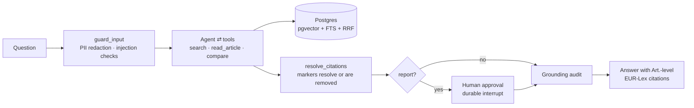

# agentic-rag-kit

[](https://github.com/fctpe/agentic-rag-kit/actions/workflows/ci.yml)
[](LICENSE)


**An enterprise-shaped agentic RAG kit you can actually pilot**: agentic retrieval over the EU AI Act and GDPR with article-level citations, durable human-in-the-loop approvals, grounding verification, eval suites, and an append-only audit trail — one Postgres, one compose file.

Most RAG demos answer questions. Regulated teams need the parts demos skip: *who approved this output, is every claim actually in the source, what happened when, and how do we know quality didn't regress after the last prompt change?* This kit makes those first-class: the LangGraph graph **is** the governance story, and the corpus (EU AI Act + GDPR) doubles as the compliance framework it's built to satisfy.

|  |  |
|---|---|
|  |  |
| Every answer is grounded in article-level sources, shown in a live citation panel with EUR-Lex links. | Report-type output stops at a durable approval gate — approve or reject with a comment for the audit trail. |

## Quickstart

```bash
git clone https://github.com/fctpe/agentic-rag-kit && cd agentic-rag-kit
cp .env.example .env          # set OPENAI_API_KEY, JWT_SECRET
make db migrate seed
make ingest-smoke             # 10 units per regulation, straight from the committed corpus
make api                      # :8000
make dev                      # :3000 — login as analyst@example.com / demo1234
```

Ask *"What obligations apply to providers of high-risk AI systems?"* — cited answer. Ask for *"a compliance report on prohibited practices"* — the approval banner appears; approve or reject with a comment.

Tests: `cd backend && uv run --group dev --group evals pytest` (336, offline) and `cd frontend && npm test` (17).

## The corpus is committed, so the numbers reproduce

The EU AI Act and GDPR live under [`data/fixtures/`](data/fixtures) as this repo's parser produced them — **212 articles and 13 annexes → 284 chunks** (AI Act 167, GDPR 117). Chunk text, the LLM-written context prefixes and the embedding vectors are *all* committed, so **a fixture ingest calls no provider at all**: you can re-derive the exact corpus every number below was measured on with no API key.

```bash
make db migrate ingest-fixture     # no OPENAI_API_KEY needed
make corpus-digest
# chunks: 284
# text:   9d3a1677bfe445ef77891a562821f33c16794a13a50b265fcf4b879cee89ad1a
# vector: f79fb68212e326271ecc5f66675aa2410a222ff3cae9772eab88b2d7d8265c83
```

Two SHA-256 digests — one over the chunk text, one over `chunks.embedding`, both in `(regulation, article_ref, idx)` order. Hashing the text alone is not enough: the vector column is what the vector arm ranks on. The same pair is committed in [`data/fixtures/corpus_digest.json`](data/fixtures/corpus_digest.json), and `make corpus-digest-check` compares a live ingest against it and exits non-zero on a mismatch — CI runs it on every push. The query side is pinned the same way for the eval: `evals/run_retrieval_eval.py` reads the committed [`evals/query_embeddings.json`](evals/query_embeddings.json) by default, with `--query-embeddings live` as the control. The application always embeds live; a user's question arrives as text.

Why the caches exist, what each key covers and what was measured on the way there: [ADR 0003](docs/adr/0003-structural-chunking-contextual-prefixes.md). `make ingest` re-fetches from live EUR-Lex and *does* need a key, because a fresh parse has no cache by definition; `make prefix-cache` and `make embedding-cache` regenerate the caches and cost money.

## Results


Live runs on 2026-08-04 against the full corpus, `gpt-4o-mini` as agent and judge. Raw outputs are committed under [`evals/results/`](evals/results), each stamped with the run that produced it and the commit that promoted it. Every figure here describes the corpus `make corpus-digest` prints above, and `backend/tests/test_published_numbers.py` fails the build if this section drifts from the artifacts.

> **RAGAS here is self-evaluation, not an audit.** `gpt-4o-mini` is both the application model and the judge, and a judge scoring its own family grades leniently on exactly the failure they share — phrasing that sounds supported. A cross-family judge is on the roadmap. The retrieval ablation below has no judge and is deterministic, which is why [`evals/thresholds.yaml`](evals/thresholds.yaml) gives retrieval `max_drift: 0.0` and gives RAGAS loose floors.

**RAGAS over the 38-question golden set** — [`evals/results/ragas.json`](evals/results/ragas.json), 0 chat failures, 0 judge failures, 38 of 38 questions contributing to every metric, 37 of 37 citable answers carrying an inline `[n]` marker:

| faithfulness | answer relevancy | context precision | context recall |
|---|---|---|---|
| 0.9453 | 0.8700 | 0.8825 | 0.9368 |

**One LLM-judged run is not an estimate, so here is the spread — and n is 2.** `promote.py` takes the newest passing run, not the best draw, so these are not cherry-picked; the two runs are eleven minutes apart.

| run | faithfulness | answer relevancy | context precision | context recall |
|---|---|---|---|---|
| `ragas_20260804T143425Z.json` | 0.9417 | 0.8688 | 0.8812 | 0.9539 |
| `ragas.json` (promoted) | 0.9453 | 0.8700 | 0.8825 | 0.9368 |

Enough to show faithfulness moving in the third decimal and `context_recall` in the second; not enough to call either a distribution.

**Eight other runs sit in `evals/results/` and the gate refuses all of them, which is the point** — two reached the API on no question at all, three predate the per-metric population check and report a denominator they did not score, and three carry answers with no inline `[n]` marker, which measures a different product. **n is a selection the gate makes, not one the author made**, and that is reproducible offline and free:

```bash
cd backend && uv run --group dev --group evals pytest tests/test_published_numbers.py -k spread
```

**Retrieval ablation** (hit-rate@6 / MRR / article recall, 38 questions, committed query vectors):

| mode | hit@6 | MRR | recall |
|---|---|---|---|
| hybrid (RRF) — production | 1.000 | 0.9057 | 0.9101 |
| vector only | 1.000 | **0.9189** | 0.9101 |
| text only (AND semantics) | 0.0263 | 0.0263 | 0.0263 |

**On this question distribution hybrid is not better than vector-only.** It ties on hit@6 and on recall and loses 0.0132 MRR. The entire gap is one question, A10, where vector-only puts the expected article first and hybrid puts it second: `1/38 × 0.5 = 0.0132`. One of 38 is not evidence in either direction, and it is not grounds for bolding hybrid's column.

```bash
jq -n --slurpfile h evals/results/retrieval_hybrid.json --slurpfile v evals/results/retrieval_vector_only.json \
  '($v[0].questions | map({(.id): .mrr}) | add) as $vm
   | $h[0].questions | map(select(.mrr != $vm[.id]) | {id, hybrid: .mrr, vector: $vm[.id]})'
# [ { "id": "A10", "hybrid": 0.5, "vector": 1.0 } ]
```

`test_published_numbers.py` runs that same comparison in Python and fails if the paragraph above stops naming every question it returns.

**Hybrid ships anyway, because the golden set cannot measure what the text arm is for.** Exactly one of the 45 golden questions cites an article number (G06, *"…principles in Article 5 GDPR?"*), so citation-shaped queries — the shape dense retrieval handles worst — are effectively absent from this distribution. The text arm returns no rows at all for 35 of the 38 scored questions, and its single hit is not G06. That is silence on natural-language questions, not precision on citation ones: **the text arm is untested here, not disproven**, and the fix is adding such questions and re-running (roadmap below), not rewording. The FTS arm uses `plainto_tsquery` (AND semantics) because generic legal vocabulary matches everywhere under OR; no committed run measures the OR variant, so no number for it is quoted.

**Red team: 14/14** — five injection classes refused, PII never echoed, out-of-scope frameworks (HIPAA, NIS2, contract drafting, specific legal advice) deflected, two benign controls answered.

```bash
make eval            # RAGAS over the golden dataset
make eval-retrieval  # the three ablation arms above
make redteam         # adversarial suite
```

Suite mechanics, metric definitions, per-run cost and the promotion rules: [`evals/README.md`](evals/README.md). CI runs the offline threshold gate and the corpus-digest check on every push; [`.github/workflows/evals.yml`](.github/workflows/evals.yml) runs the scored suites weekly against a provider key.

## How it works



- **Durable human-in-the-loop** — report output stops at a LangGraph `interrupt()` checkpointed in Postgres. Kill the backend mid-approval, restart, approve — the run resumes. A report never streams: the draft reaches the user in the approval payload or not at all, and an admin can decide another user's approval, so reviewer and author need not be the same person. **The gate is policy, not a security boundary — RBAC is** ([ADR 0001](docs/adr/0001-langgraph-explicit-stategraph.md)).
- **Grounding verification** — a judge checks each claim against the retrieved article text after every answer and reports the ones **no** source supports *to the user* instead of shipping them silently. It fails closed: a run that verified nothing reports `grounded=false` with the reason. A qa answer streams before the verdict exists, and the UI marks that window unverified.
  **It verifies support, not attribution — a claim that cites the wrong article passes.** Observed: *"All AI systems must process personal data in accordance with the GDPR (AI Act, Art. 50(3))"* was judged grounded, though Art. 50(3) is about emotion-recognition disclosure. That is deliberate — judging citation numbers made the check flag *correct* enumerations — and [docs/security.md](docs/security.md) states the boundary.
- **A linkable citation marker is a property of the system, not a request to the model** — the UI links one shape, `[n]`, and the model reliably writes something else (`[4, Art. 4(5)]`). A deterministic node rewrites the merged shapes, **removes** any index that was never retrieved, and refuses to link a bracket whose spelled-out reference contradicts the source it numbers, reporting each refusal instead of guessing. No model call; asking for the shape in the prompt was tried and measured worse. Replay every committed eval answer against its real source list, offline and free: `cd backend && uv run --group dev --group evals pytest tests/test_citation_markers.py -s -k merged` ([ADR 0007](docs/adr/0007-citation-markers-resolved-in-code.md)).
- **Hybrid retrieval in one SQL statement** — pgvector cosine + Postgres FTS fused with RRF (k=60), with `hnsw.iterative_scan` guarding against the classic filtered-query overfiltering failure. No second search engine ([ADR 0002](docs/adr/0002-hybrid-rrf-in-postgres.md)).
- **Structure-aware ingestion** — chunks never cross the boundary of the unit they came from, and every chunk carries that unit's ref (`Art. 6`, `Annex III`), so citations deep-link into the right place in EUR-Lex (`#art_6`, `#anx_III`). Annexes are citable units in their own right: the AI Act's high-risk list is Annex III, and Art. 6(2) only points at it ([ADR 0003](docs/adr/0003-structural-chunking-contextual-prefixes.md)).
- **Security you can point at** — OWASP LLM Top 10 (2025) mapping, PII redaction at the API boundary (before the model, a trace, *and* the checkpointer — [ADR 0004](docs/adr/0004-sqlalchemy-sse-redaction-choices.md)), JWT RBAC with object-level ownership checks, and a hash-chained audit log framed against AI Act Art. 12/14: `GET /audit/verify` names the first entry an edit — or a deletion between two others — broke. It is tamper-*evidence*, not tamper-proofing; [docs/security.md](docs/security.md#audit-trail-eu-ai-act-art-12-framing) tabulates what it does not catch.
- **Telemetry** — OTel spans on the GenAI semantic conventions around every graph node, tool call, retrieval and the grounding verifier, with token and cost accounting from `usage_metadata`, plus JSON logs correlated by request and trace id. OTLP to any collector, Langfuse included; unset endpoint means no exporter at all ([ADR 0006](docs/adr/0006-otel-genai-spans-and-structured-logs.md)).

Request flow, SSE event table and why one Postgres: [docs/architecture.md](docs/architecture.md).

## Limitations

- **Grounding checks support, not attribution.** A misattributed claim passes (see above). `resolve_citations` narrows this only where the model wrote the reference *inside* the bracket; a reference in ordinary prose next to a marker is still unchecked.
- **Refusal boundaries are probabilistic.** Two review passes each surfaced a *different* out-of-scope question the model answered instead of deflecting (HIPAA once, specific legal advice once). Both are now firm prompt rules with regression cases.
- **Live EUR-Lex is intermittent** — it sometimes answers document URLs with `HTTP 202` and an empty body, which `raise_for_status()` waves through. `fetch_html` rejects any body under 20 KB and `make ingest` fails with a named `FetchError` rather than handing an empty string to the parser. That flakiness is why the corpus is committed; `make ingest-smoke` and `make ingest-fixture` never touch the network.
- **Corpus is articles and annexes, no recitals, English only.** Both kinds are addressed and cited under their own ref (ADR 0003). The GDPR has no annexes; zero is an ordinary result there, not a failure.
- The router's report-detection is heuristic-first; unusual phrasings can miss the approval gate.
- PII redaction is structural (emails, phones, IBANs, cards); free-text names need the documented Presidio swap.
- The grounding audit adds one model call of latency to every answer, and rejected reports end the run — there is no revision loop yet.
- Single-tenant by design; per-document ACLs and SSO are out of scope for the kit.
- The audit chain is unkeyed sha256 over columns the database can rewrite, so it detects edits made *around* the application, not an attacker who recomputes the chain — and deleting the newest entries leaves the rest walking clean (ADR 0005).
- The GenAI semantic conventions are still Development status, so span attribute names can move; the OTel packages are pinned exactly and a test holds the names to the generated constants (ADR 0006). Span cost is whatever you configure — the repo ships no price table.

## Regulatory accuracy

Docs and corpus reflect the **2026 Digital Omnibus** (adopted June 2026): Annex III high-risk obligations apply from 2 Dec 2027; Art. 50 transparency largely from Aug 2026.

## Design decisions

Short ADRs in [`docs/adr/`](docs/adr): explicit StateGraph over prebuilt agents, hybrid RRF inside Postgres, structural chunking (+ why late chunking was rejected, and why the corpus caches exist), SQLAlchemy over SQLModel, SSE over WebSockets, regex redaction with a Presidio seam, per-request budgets and the audit hash chain, OTel GenAI spans against conventions that are not stable yet, citation markers resolved in code.

Architecture walkthrough in [docs/architecture.md](docs/architecture.md); deployment — compose, a kustomize base + local overlay under [`deploy/`](deploy), and a Terraform module for the managed Postgres, secrets and DNS — in [docs/deployment.md](docs/deployment.md). Security posture is summarised in [SECURITY.md](SECURITY.md) and covered in full in [docs/security.md](docs/security.md).

## Roadmap

- A cross-family RAGAS judge, so the numbers stop being self-evaluation.
- Citation- and lexical-shaped golden questions, so the text arm's precision is measured instead of asserted and the hybrid-vs-vector choice rests on something.
- Golden questions whose answer is an annex — the harness already scores `AI Act Annex III` as an expected unit, and no question yet exercises it.
- Style-matching RAG over previously **approved** reports, so drafts converge on the reviewing team's voice.
- Revision loop on rejection (reviewer comment feeds a redraft pass).
- German corpus variant (second `tsvector` configuration).

---

AI-assisted scaffolding; architecture, retrieval design, prompts, evals, and the governance model are hand-designed — the ADRs record the reasoning.

[MIT](LICENSE)
