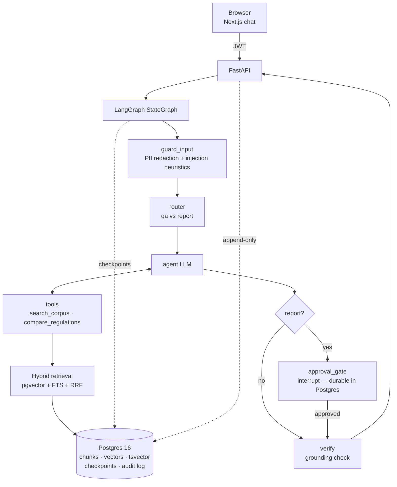

# Architecture

## Request flow

1. **Ingestion (offline)** — `app/ingestion/pipeline.py` fetches the EU AI Act and GDPR from EUR-Lex, parses them into articles via the `ti-art`/`sti-art` markup, chunks on article boundaries (≤700 tokens), prepends deterministic + optional LLM context prefixes, embeds, and stores everything in one Postgres.
2. **Chat** — `POST /chat` streams SSE: `token` events from the agent node only, `approval_required` when the graph interrupts, `citations` + `grounding` from the verify node, `done` with the authoritative final text. The response header `X-Thread-Id` carries the LangGraph thread.
3. **Retrieval** — both arms always run (cosine top-20 + `ts_rank_cd` top-20), RRF (k=60) fuses, final 6 reach the model wrapped in `<source id=…>` tags that the system prompt declares to be data, not instructions.
4. **Approvals** — report-type answers hit `interrupt()`. The checkpoint lives in Postgres (`AsyncPostgresSaver`), so the pending approval survives restarts; `POST /chat/{thread}/resume` continues the same graph with `Command(resume=…)`. Verified by killing uvicorn mid-approval and resuming after restart.
5. **Verification** — a grounding pass audits the answer against the retrieved excerpts and flags unsupported claims to the user rather than silently shipping them.

## SSE protocol

| event | payload | meaning |
|---|---|---|
| `token` | `{text}` | streaming model output |
| `approval_required` | `{draft, citations}` | graph interrupted at the approval gate |
| `citations` | `{citations: [{index, regulation, article, heading, url, snippet, score}]}` | sources used |
| `grounding` | `{grounded, issues}` | faithfulness audit result |
| `done` | `{thread_id, content}` | authoritative final message |
| `error` | `{message}` | stream failed |

## Why one Postgres

App state, vectors (pgvector 0.8 HNSW), full-text search, LangGraph checkpoints, and the append-only audit log share one database. For a deployment kit meant to be piloted inside an enterprise network, every extra stateful service is a procurement conversation — see ADR 0002.
