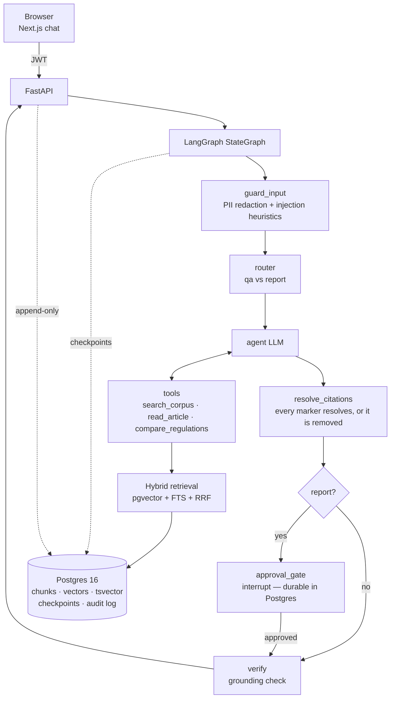

# Architecture

## Request flow

1. **Ingestion (offline)** — `app/ingestion/pipeline.py` fetches the EU AI Act and GDPR from EUR-Lex and parses them into citable units — articles (`Art. 6`) and annexes (`Annex III`), each read from its own EUR-Lex container id (`art_6`, `anx_III`) — or reads the same units from the committed `data/fixtures/` with `--source fixture`. From there the paths diverge in exactly one way, deliberately: both chunk on unit boundaries (≤700 tokens), prepend a deterministic context prefix, and store everything in one Postgres — but `--source fixture` *reads* the LLM context sentence and the embedding vector from `data/fixtures/`, while `--source network` generates and requests them. Neither call is deterministic (no seed for the model; the embedding endpoint returned different vectors for identical text in 99–141 of 284 rows on every ingest), so the committed corpus cannot depend on either. A fixture ingest consequently calls no provider at all, and `make corpus-digest` hashes both the text and `chunks.embedding` to prove it reproduces — ADR 0003. Annexes are chunked exactly like articles; ingesting Annex III whole would let it crowd out the articles that cite it (ADR 0003).
2. **Chat** — `POST /chat` streams SSE: `token` events from the agent node only, `approval_required` when the graph interrupts, `citations` + `grounding` from the verify node, `done` with the authoritative final text. The response header `X-Thread-Id` carries the LangGraph thread. Streamed tokens are the model's raw output; `done.content` is the text after `resolve_citations`, which is why the frontend replaces the bubble with it rather than keeping what streamed.
3. **Retrieval** — both arms always run (cosine top-20 + `ts_rank_cd` top-20), RRF (k=60) fuses, final 6 reach the model wrapped in `<source id=…>` tags that the system prompt declares to be data, not instructions.
4. **Approvals** — report-type answers hit `interrupt()`. The checkpoint lives in Postgres (`AsyncPostgresSaver`), so the pending approval survives restarts; `POST /chat/{thread}/resume` continues the same graph with `Command(resume=…)`. Verified by killing uvicorn mid-approval and resuming after restart.
5. **Citation resolution** — `resolve_citations` runs on the single path from "the model has answered" to the user, before both the approval gate and the grounding check, and rewrites the answer so every `[n]` left in it resolves to a retrieved source. Merged brackets (`[4, Art. 4(5)]`, `[2(a)]`, `[7, 8]`) become real markers; an index that was never retrieved is removed; a bracket whose spelled-out reference contradicts the source it numbers is left as literal text rather than turned into a confidently wrong link. Every refusal is reported in `citation_issues`. Deterministic — no model call — and it writes back into the checkpointed message, so the reviewer, the verifier and the persisted transcript all read one string. ADR 0007.
6. **Verification** — a grounding pass audits the answer against the retrieved excerpts and reports the claims *no* excerpt supports to the user rather than silently shipping them. It judges support, not attribution — a claim citing the wrong article passes; see [security.md](security.md).
7. **Telemetry** — one OTel span per graph node, tool call, retrieval and grounding check, on the GenAI semantic conventions, with tokens and cost from `usage_metadata`; JSON logs on stdout correlated by request id and, when tracing is on, trace id. Both sinks are inert until configured — ADR 0006.

## SSE protocol

| event | payload | meaning |
|---|---|---|
| `token` | `{text}` | streaming model output |
| `approval_required` | `{draft, citations, citation_issues}` | graph interrupted at the approval gate |
| `citations` | `{citations: [{index, regulation, article, heading, url, snippet, score}]}` | sources used |
| `grounding` | `{grounded, issues}` | faithfulness audit result — factual support only; citation-resolution problems travel in `citation_issues`, so the `ragkit.grounded=false` alert does not fire on formatting |
| `done` | `{thread_id, content, citation_issues}` | authoritative final message, and the brackets in it that could not be linked |
| `error` | `{message}` | stream failed |

## Why one Postgres

App state, vectors (pgvector 0.8 HNSW), full-text search, LangGraph checkpoints, and the append-only audit log share one database. For a deployment kit meant to be piloted inside an enterprise network, every extra stateful service is a procurement conversation — see ADR 0002.
